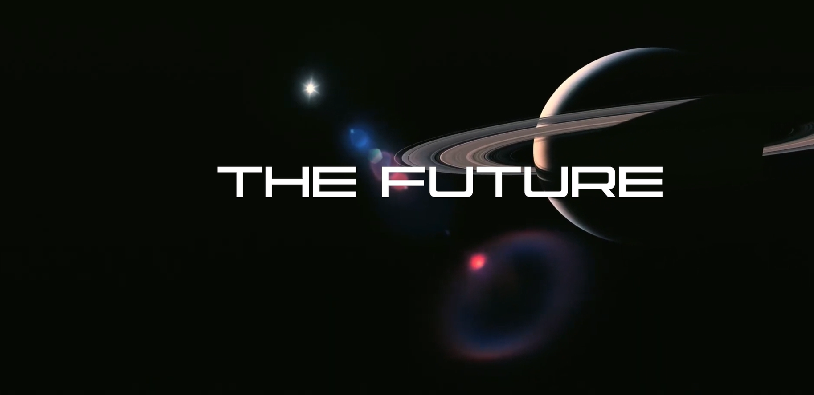
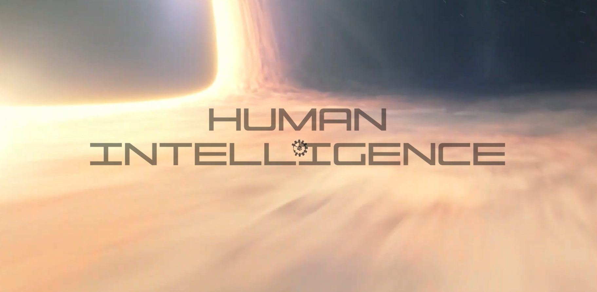

### Presenting Our Brand New Innovation:
# `DEVELOPER A` 
### `The first H.I. powered code assistant`

### Our innovative `Human Intelligence` is on its path to change the view of development, with actual human errors and coffee breaks, not replacable by any Artificial Intelligence.

### This is:

 
 

# On a serious note:
### This is a parody portfolio, where I `Avneet Singh` also called `Developer A` is the product to be sold. 
### I have tried my best to sprinkle some humour to the aspect of portfolios, with some hidden jokes and comedy, So dont take it very seriously and with a grain of salt.

 
 

# Tech used:
### I have used React library, along side some other easuly available libararies for frontend.
### Also Typescript is used to avoid making `Human` errors and I also used a lot of `Chat GPT` for help (Ironic, I know!).
### Deployed on vercel for now, with non custom domain.

